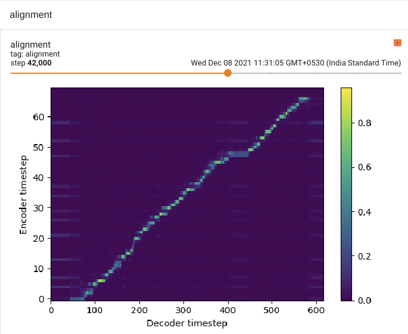

# Text to Speech Synthesis for Indic Languages using Tacotron2

 

# About

This repository contains steps to train [NVIDIA/tacotron2](https://github.com/NVIDIA/tacotron2) on a multi speaker Hindi Language dataset. 

# Demo 
<iframe width="100%" height="166" scrolling="no" frameborder="no" allow="autoplay" src="https://w.soundcloud.com/player/?url=https%3A//api.soundcloud.com/tracks/1178426269&color=%23ff5500&auto_play=false&hide_related=false&show_comments=true&show_user=true&show_reposts=false&show_teaser=true"></iframe><div style="font-size: 10px; color: #cccccc;line-break: anywhere;word-break: normal;overflow: hidden;white-space: nowrap;text-overflow: ellipsis; font-family: Interstate,Lucida Grande,Lucida Sans Unicode,Lucida Sans,Garuda,Verdana,Tahoma,sans-serif;font-weight: 100;"><a href="https://soundcloud.com/aastha-singh-948869638" title="Aastha Singh" target="_blank" style="color: #cccccc; text-decoration: none;">Aastha Singh</a> · <a href="https://soundcloud.com/aastha-singh-948869638/tacotron2" title="Tacotron2" target="_blank" style="color: #cccccc; text-decoration: none;">Tacotron2</a></div>
# Index 

1. Pre-requisites
2. Setup
   - 2.1 [Torch from binary](#torch-from-binary)
   - 2.2 [Apex](#apex)
   - 2.3 [Other Python requirements](#other-python-requirements)
3. Dataset
   - 3.1 [About dataset](#about-dataset) 
   - 3.2 [Download and extract dataset](#download-and-extract-dataset)
4. Data Preprocessing
   - 4.1 [Creating train and test text files](#creating-train-and-test-text-files)
5. Training
   - 5.1 [Training using pretrained weights](#training-using-pretrained-weights)
   - 5.2 [Training from scratch](#training-from-scratch)
   - 5.3 [Multi-GPU (distributed) and Automatic Mixed Precision Training](#multi-gpu-and-automatic-mixed-precision-training)
   - 5.4 [View Tensorboard](#view-tensorboard)
6. Inference
    - 6.1 [Download pre-trained models](#download-pre-trained models)
    - 6.2 [Run Jupyter notebook](#run-jupyter-notebook)
7. Related repos
8. Acknowledgements

---

## 1. Pre-requisites

- NVIDIA GPU
- NVIDIA CUDA installation. More on it [here](https://developer.nvidia.com/cuda-toolkit).

---

## 2. Setup

### 2.1 [Torch] from binary

Clone the repository

```sh
git clone --recursive https://github.com/pytorch/pytorch
cd pytorch
# if you are updating an existing checkout
git submodule sync
git submodule update --init --recursive --jobs 0
```

Build and install

```sh
export CMAKE_PREFIX_PATH=${CONDA_PREFIX:-"$(dirname $(which conda))/../"}
python setup.py develop
```

### 2.2 [Apex]

Apex is used for mixed precision and distribued training.

```sh
git clone https://github.com/NVIDIA/apex
cd apex
pip install -v --disable-pip-version-check --no-cache-dir --global-option="--cpp_ext" --global-option="--cuda_ext" ./
```

### 2.3 Other Python requirements

Other pythonic dependencies are listed in `requirements.txt`

```sh
pip3 install -r requirements.txt
```

---

## 3. Dataset

### 3.1 About Dataset

* This version of Tacotron2 is trained on high-quality Hindi multi-speaker speech data set from [OpenSLR](http://www.openslr.org/103/)
* The Hindi speech dataset is split into train and test sets with 95.05 hours and 5.55 hours of audio respectively
* There are 4506 and 386 unique sentences taken from Hindi stories in the train and test sets, respectively, with no overlap of sentences. The train set contains utterances from a set of 59 speakers, and the test set contains speakers from a disjoint set of 19 speakers
* The audio files are sampled at 8kHz, 16-bit encoding. The total vocabulary size of the train and test set is 6542

### 3.2 Download and Extract Dataset

```sh
# Download train dataset
wget https://www.openslr.org/resources/103/Hindi_train.tar.gz

# Extract train dataset
tar xvf Hindi_train.tar.gz

# Download test dataset
wget https://www.openslr.org/resources/103/Hindi_test.tar.gz

# Extract test dataset
tar xvf Hindi_test.tar.gz

# Copy the data to dataset folder
mkdir HindiDataset
mv train HindiDataset/
mv test HindiDataset/
```

---


## 4. Data Preprocessing

OpenSLR data consists of `transcription.txt` file. This needs to be converted into the format
compatible with tacotron2 training.

### 4.1 Upsample to 22050 Hz

```sh
python3 upsampler.py HindiDataset/train/audio/
python3 upsampler.py HindiDataset/test/audio/
```

### 4.2 Creating train and test text files

Run `filelist_creator.py` to create text files for training

```sh
python3 filelist_creator.py HindiDataset/
```

---

## 5. Training

### 5.1 Training using a pre-trained model (recommended)

Training using a pre-trained model can lead to faster convergence
By default, the dataset dependent text embedding layers are [ignored]

Download NVIDIA pre-trained [Tacotron 2] model

```sh
python3 train.py --output_directory=outdir --log_directory=logdir -c tacotron2_statedict.pt --warm_start
```

### 5.2 Training from scratch

You can train a model from scratch

```sh
python3 train.py --output_directory=outdir --log_directory=logdir
```

### 5.3 Multi-GPU (distributed) and Automatic Mixed Precision Training

```sh
python3 -m multiproc train.py --output_directory=outdir --log_directory=logdir --hparams=distributed_run=True,fp16_run=True
```

### 5.4 View Tensorboard

Model accuracy and alignment can be easily monitored using tensorboard

```sh
tensorboard --logdir=outdir/logdir
```

---

## 6. Inference demo

### 6.1 Download pre-trained models

1. Download waveglow from [here](https://drive.google.com/file/d/1hjGdxKRsG_lgemRmbK6A0MceFOPaFY8Q/view?usp=sharing)
2. Download pre-trained hindi from [here](https://drive.google.com/file/d/1hjGdxKRsG_lgemRmbK6A0MceFOPaFY8Q/view?usp=sharing)

N.b. When performing Mel-Spectrogram to Audio synthesis, make sure Tacotron 2
and the Mel decoder were trained on the same mel-spectrogram representation.

### 6.2 Run jupyter notebook

```sh
jupyter notebook --ip=127.0.0.1 --port=31337
```

Run `inference.ipynb`.

---

## 7. Related repos

[NVIDIA/tacotron2](https://github.com/NVIDIA/tacotron2.git) Original work this repository is inspired from.

[WaveGlow](https://github.com/NVIDIA/WaveGlow) Faster than real time Flow-based
Generative Network for Speech Synthesis

[nv-wavenet](https://github.com/NVIDIA/nv-wavenet/) Faster than real time
WaveNet.

---

## 8. Acknowledgements
This implementation uses code from the following repos: [Keith
Ito](https://github.com/keithito/tacotron/), [Prem
Seetharaman](https://github.com/pseeth/pytorch-stft) as described in our code.

We are inspired by [Ryuchi Yamamoto's](https://github.com/r9y9/tacotron_pytorch)
Tacotron PyTorch implementation.

We are thankful to the Tacotron 2 paper authors, specially Jonathan Shen, Yuxuan
Wang and Zongheng Yang.


[WaveGlow]: https://drive.google.com/open?id=1rpK8CzAAirq9sWZhe9nlfvxMF1dRgFbF
[Tacotron 2]: https://drive.google.com/file/d/1c5ZTuT7J08wLUoVZ2KkUs_VdZuJ86ZqA/view?usp=sharing
[Torch]: https://github.com/pytorch/pytorch#installation
[website]: https://nv-adlr.github.io/WaveGlow
[ignored]: https://github.com/NVIDIA/tacotron2/blob/master/hparams.py#L22
[Apex]: https://github.com/nvidia/apex
[AMP]: https://github.com/NVIDIA/apex/tree/master/apex/amp
